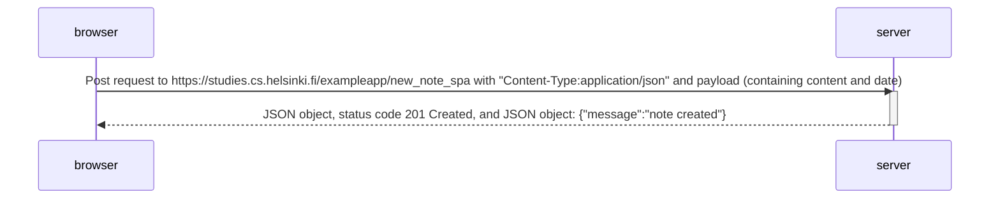

0.6: new note in single page app diagram

> assuming the single page app is already open

```mermaid
sequenceDiagram
  participant browser
  participant server

  browser->>server: Post request to https://studies.cs.helsinki.fi/exampleapp/new_note_spa with "Content-Type:application/json" and payload (containing content and date)
  activate server
  server-->>browser: JSON object, status code 201 Created, and JSON object: {"message":"note created"}
  deactivate server
```
